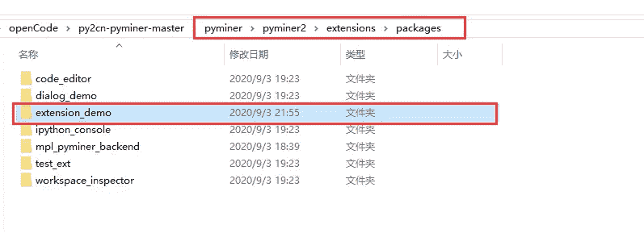
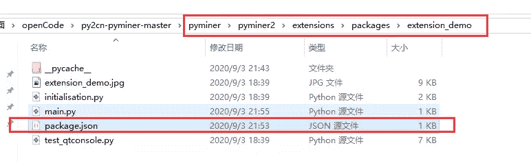
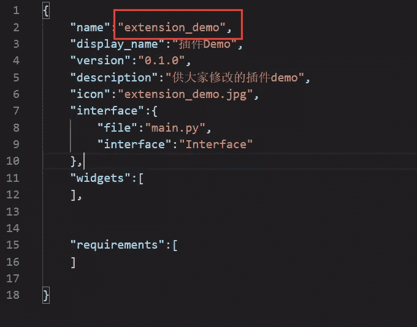
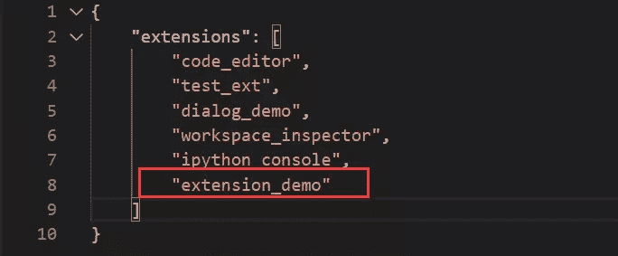
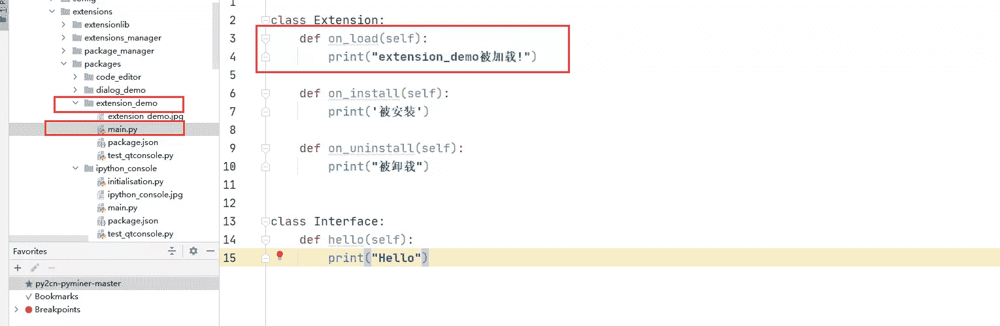
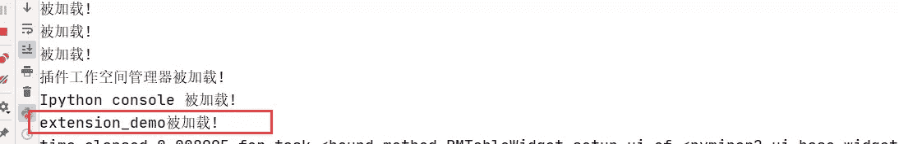
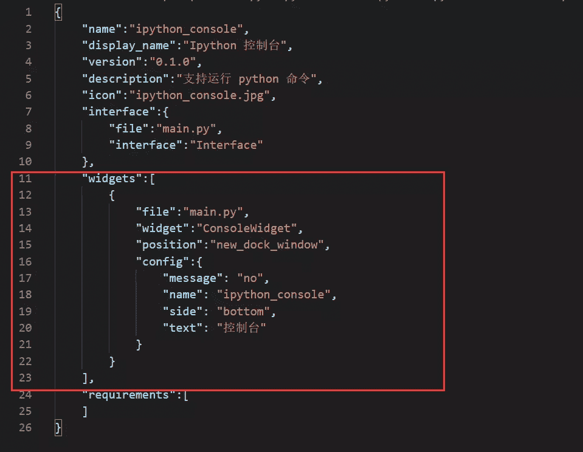
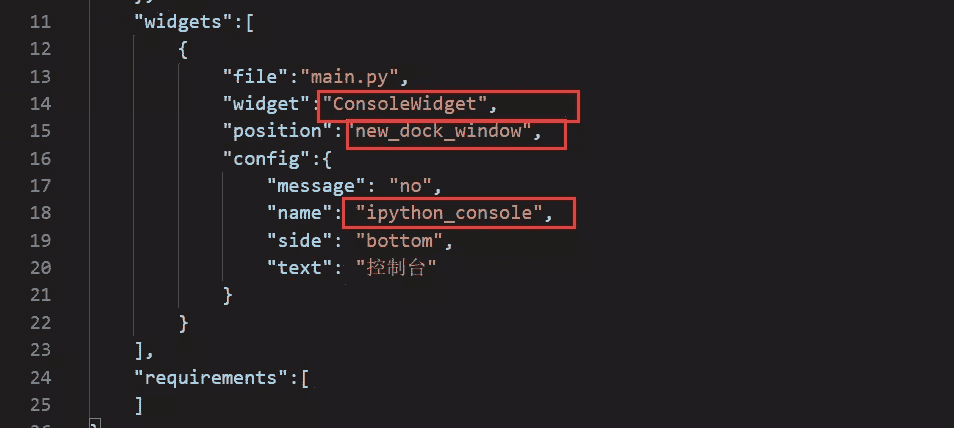

# API接口


# 插件应用指南

主要分为三步，分别是：（1）、改插件demo （2）、改package.json (3)、改extensions.json （4）、补充

## (1)、 改插件demo

打开../pyminer2/extensions/packages 文件夹，复制extension_demo到packages文件夹下  【extension_demo文件的位置】

更改复制后的插件的名称，并将所需的图片文件放在该目录下。

## （2）、改package.json

打开刚刚复制的插件的位置，进入你的插件目录下的package.json 如../pyminer2/extensions/packages/extension_demo/package.json  【package.json的位置】

修改里面的信息  【package.json必须修改的地方】 package.json中的**name字段** 必须改成你自己的插件的名称和插件入口的名称。

## (3)、改extensions.json

打开../pyminer2/config/extension.json，将你插件的名称加入到json中  【extension.json的结构】

打开你插件的main.py文件，修改插件被加载时打印的信息。  【修改插件初始化信息】

 【运行程序，观察插件是否被加载】

若输出信息里有你插件的名称，则插件已被加载。

## （4）、补充

若往插件里添加widget等控件时，先将.ui文件和.py文件放在插件下面，并在该插件下的package.json中添加该控件的信息。

如，ipython_console插件中需要修改widget节点下的信息  【ipython_console插件中的package.json信息】

 【必须要修改的地方】

**widget** 的值为需要添加的ui文件的类名称

**position** 的值为widget摆放的位置

**name** 的值为该插件的名称

在该插件的main.py的on_load方法下，传入该widget的名称，获得该widget的实例，再通过获取控制台中的数据与界面进行交互。其中externlib的文件夹下的python文件里的一些接口是用来获取和传递交互信息的方法，可供使用者调用。

```
1.  `class  Extension:`2.  `def on_load(self):`3.  `self.console =  self.widgets['ConsoleWidget']`4.  `self.console.connect_to_datamanager(self.extension_lib)`5.  `print("Ipython console 被加载!")`7.  `def on_install(self):`8.  `print('被安装')`10.  `def on_uninstall(self):`11.  `print("被卸载")`14.  `class  Interface:`15.  `def hello(self):`16.  `print("Hello")`
```